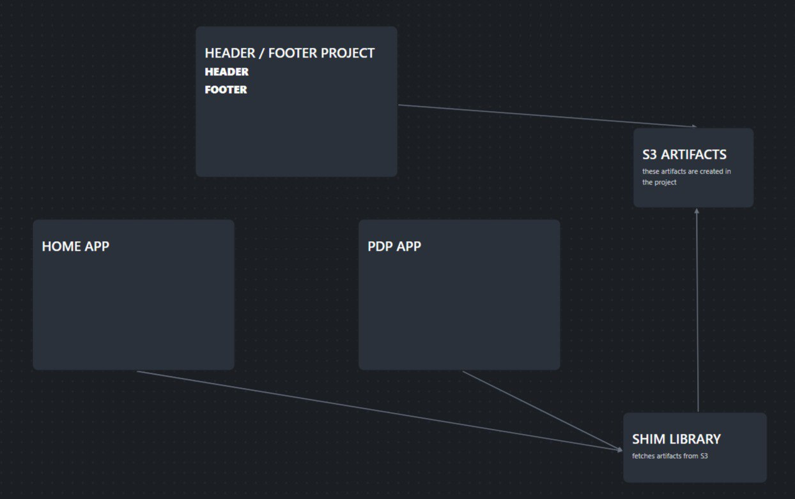

# Стандартный подход к переиспользованию модулей между сервисами таков

# Федерация Модулей Webpack 5 все упрощает (Микросервисная архитектура)

## Плюсы

- Можно делиться любым JS кодом
- Обновление одного модуля будет показываться во всех других сразу
- Можно делиться состоянием
- Тестирование, роутинг легко добавляется

## Минусы

- При ошибке в модуле, все сервисы, которые его используют упадут, поэтому следует оборачивать опасные зоны с логикой в `<ErrorBoundary />`
